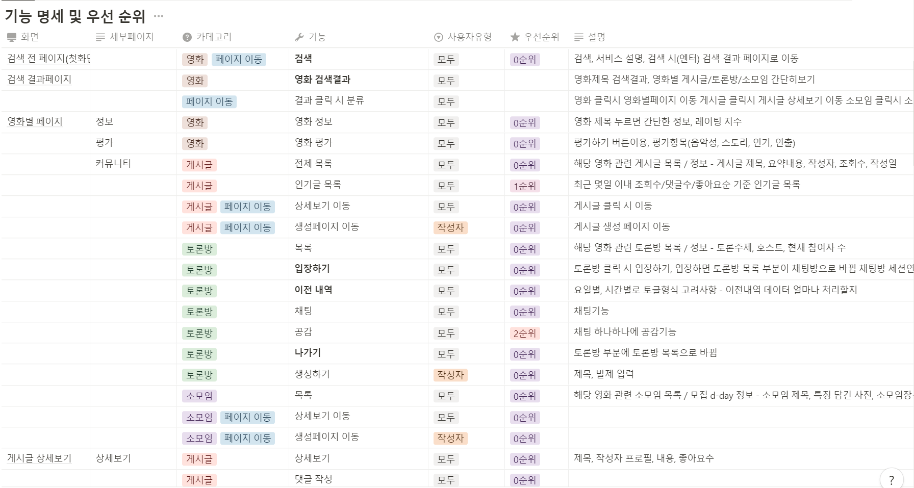
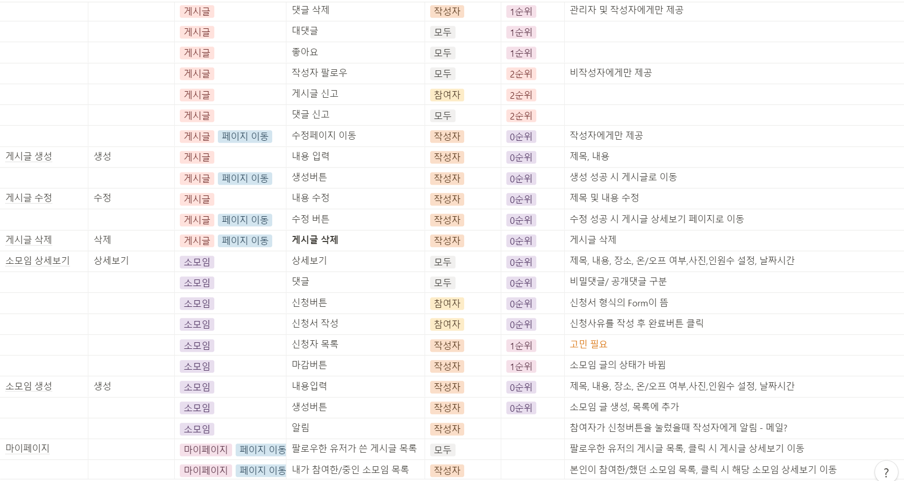
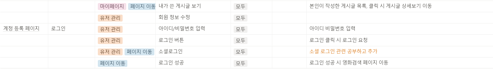
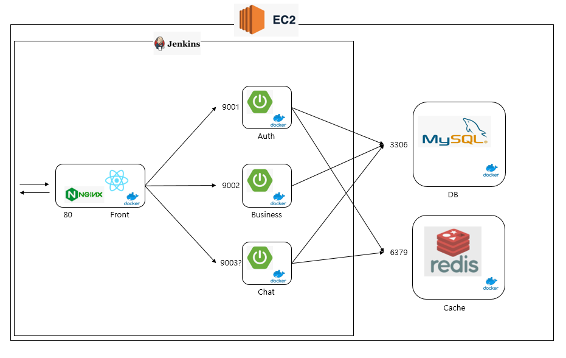

# 🌜달뜸 

<a href="https://www.notion.so/10060a5fedfe44a7aae0b016f46850c1">서비스 기획서 링크</a>

<a href="https://www.notion.so/d77662c21b244091ba3b8f554236bb8a">기능명세서 링크</a>

<a href="https://www.notion.so/API-68b0b8dfecb34b4aaafe785eada86e2f">API명세서 링크</a>

# 서비스 기획서

## 🤩서비스를 사용하는 사람들

- 20대/여자/영화덕후 **영희 👩**
    
    영희의 취미는 영화관에서 영화보기. 사랑하는 영화가 생기면 N차관람은 기본! GV도 다니고, 대본집도 사보고 감독판까지 섭렵한다. 영화를 보면 볼수록 새로운 장면과 대사가 보이고 ‘배운변태’인 감독님이 숨겨놓은 뜻까지. 이걸 나만 알 수는 없는데 친구들은 내가 보는 독립영화들은 마이너라고 말한다ㅜㅜ 나랑 같은 영화를 좋아하는, 영화의 깊은 맛을 음미할 수 있는 사람들과 밤새도록 영화에 대해 떠들고 싶다.
    
- 20대/남자/OTT부자 **철수 🧑**
    
    철수의 취미는 집에서 영화보기. 코로나19 이후 부쩍 집에 있는 시간이 늘어났다. 야호 그동안 못본 영화나 잔뜩 봐야지! OTT를 잔뜩 구독해 영화를 보고있다. 조용하고 편안하게 영화를 보는건 좋은데.. 감상을 말할 창구가 없다. 이 영화 정말 미쳤는데 누구와 떠들지? 게다가 요즘 OTT에서 독점제공하는 작품은 평점을 제공하는 곳이 없어서 타인의 반응이 궁금하다.
    
- 30대/여자/ 밖순이 **원희** 👩‍🦰
    
    원희의 취미는 영화보기. 그리고 수다떨기다. 집에 있는건 몸이 근질거린다. 많은 친구, 다채로운 경험이 재미있는 삶이라 여긴다. 영화를 보고나면 영화에 대해 백분토론하는 것은 물론 영화에 나온 장소도 가보고 싶고, 주인공이 즐겨마시는 위스키도 맛보고 싶다. 그런데 누구랑 같이가지?
    

<aside>
🍿 영화보고 달뜬 마음, 🌜달뜸으로 가져오세요!

</aside>

## 현재 영화리뷰에 사용되고 있는 서비스들

- 트위터 : 트위터에서 영화에 대한 감상을 남기거나 토론이 이어지지만, 트위터의 모토인  ‘실시간’이라는 특성상,글자수 제한으로 정제된 글로 리뷰를 남기기 힘들다. 또한 실시간의 범람속에서 깊은 대화를 나누기 힘들다.
- 디시인사이드 등 커뮤니티 : 게시글 형태로 영화에 대한 대화가 이어지지만, 대형 커뮤니티 특성상 신규 사용자가 커뮤니티 분위기에 적응하기 힘들고, 영화 정보를 제공하지는 않고 있다.
- 유튜브 : 유튜브 크리에이터가 영상으로 영화에 대한 리뷰를 올린다. 하지만 유튜브를 끝까지 시청하지 않고는 그 내용을 다 파악하기 어렵고, 시청자와 리뷰어의 상호 소통은 불가능하다
- 블로그 : 블로그에 영화 태그를 걸고 리뷰를 포스팅하는 블로거가 있다. 하지만 커뮤니티에 작성되는 리뷰와 블로그의 리뷰의 수요층이 다르다. 커뮤니티의 주요한 기능은 비슷한 공감대를 가진 사람들이 모여 ~것이다. 포털사이트의 검색기능은 단편적인 사실관계 및 정보전달에 초점을 맞추어져있다. 포털사이트의 블로그의 전문을 읽고 리뷰에 대한 토론을 나누고자 하는 사람보다, 영화가 재미있는지, 쿠키가 있는지 등 짧고 명료한 검색결과를 얻고자 하는 경우가 많을 것이다.

<aside>
🍿 영화의, 영화에 의한, 영화를 위한 커뮤니티가 필요해요.

</aside>

## 🌜달뜸이 제공하는 서비스

🎞 **영화의::** 영화 정보 제공 : 영화에 대한 기본적인 정보 뿐만 아니라 우리 서비스 만의 영화에 대한 평점을 산출하여 우리 사이트의 이용자들은 영화를 어떻게 감상했는지 참고할 수 있다.

👨‍👩‍👦‍👦 **영화에 의한 ::** 소모임 : 취향이 비슷한 사람들과 만나 영화에 관련된 모임을 진행할 수 있는 플랫폼

🔊 **영화를 위한::** 영화 리뷰&토론 : 영화 감상 후 분석글과 리뷰를 남길 게시판과 토론을 할 수 있는 채팅창으로 구성된다. 

## 사용자 시나리오

| 메인 시나리오
(웹 서비스 기준) | 페이지 | 페이지 설명 | 기능 |
| --- | --- | --- | --- |
| 1. 검색, url 등을 통해 서비스에 첫 진입했을 때 | 첫 화면 | 첫 화면에는 큰 검색창만 띄워 사용자가 보고온 영화를 검색할 수 있도록 한다. |  |
| 1-1. 첫 화면에서 검색을 진행한 경우 | 검색화면 | 단어를 검색하면 해당 단어 정보를 가지고 있는 영화의 포스터를 제목에 포함-내용에 포함 순으로 정렬해 보여준다. 그 밑에 해당 단어를 포함하는 게시글, 토론을 보여준다. 그 밑에 해당 단어를 포함하는 소모임을 보여준다. 영화 포스터를 클릭하면 5.영화정보페이지로 연결한다. 게시글, 토론, 소모임을 클릭하면 3.로그인 페이지로 연결한다. |  |
| 2. 메인화면 | 메인 페이지 | 첫 화면을 스크롤로 내리면 메인페이지가 나온다. 메인페이지에는 인기게시글, 인기토론, 새로운 소모임, 추천 영화를 보여준다.  |  |
| 3. 로그인 | 로그인 페이지 | 로그인을 하지 않은 유저가 게시글, 토론, 소모임 게시글을 클릭하였을 때 로그인 페이지로 연결한다.
로그인 | 유저 |
| 4. 회원가입 | 회원가입 페이지 | 이메일을 이용한 회원가입과 소셜로그인(구글, 네이버, 카카오)을 제공한다.  | 유저 |
| 4-1. 회원가입 후 상세정보 기입 | 상세정보 기입 페이지 | 회원가입 후 첫 로그인하는 회원, 또는 상세정보를 입력하지 않은 회원이 로그인 한 경우 상세정보를 입력받는 페이지를 보여준다. 상세정보는 영화추천, 개인 맞춤별 피드 구성 등에 사용된다. | 유저 |
| 5. 영화정보 | 영화정보 페이지  | 해당 영화에 대한 기본적인 정보를 제공한다. 포스터, 제목, 감독, 배우, 장르, 상영시간 ’달뜸’만의 정보를 제공한다. 보름달지수, 해당 작품을 감상할 수 있는 OTT, 해당 작품이 태그되어있는 게시글, 토론, 소모임(3.로그인 페이지) | 영화정보 |
| 5-1. 점수 | 영화정보페이지 | 평가하기 버튼을 누르면 점수를 입력할 수 있는 창이 나온다.   | 영화정보 |
| 6. 게시글 | 게시글리스트 페이지 | 게시글 전체보기를 클릭하면 해당 영화의 게시글을 리스트로 보여준다. | 게시글 |
|  | 단일 게시글 페이지  | 특정 게시글을 클릭하면 해당 게시글을 보여준다. 좋아요, 북마크, 댓글, 팔로우 기능을 사용할 수 있다. | 게시글 |
| 6-1. 게시글 댓글 | 단일 게시글 페이지 | 게시글에 대한 댓글/대댓글을 달 수 있다.  | 게시글 |
| 6-2. 게시글 작성 | 게시글 작성 페이지 | 게시글을 작성할 수 있는 페이지이다. 영화, 제목, 리뷰내용, 파일(사진, gif),  | 게시글 |
| 6-3. 게시글 설정 | 단일 게시글 페이지 | 게시글 작성자는 게시글을 수정, 삭제 할 수 있다.  | 게시글 |
| 7. 토론 | 토론 리스트 페이지 | 토론 전체보기를 클릭하면 해당 영화의 토론을 리스트로 보여준다. | 토론              |
|  | 단일 토론 페이지 | 특정 토론을 클릭하면 해당 토론 채팅창으로 연결된다. 채팅창에서는 전에 진행되고있던 내용을 볼 수 있다. | 토론 |
| 7-1. 토론 채팅 | 토론채팅 페이지 | 토론이 진행되고 있는 채팅으로 이동한다. 채팅은 과거의 내용도 볼 수 있고, 채팅 내용 검색기능을 제공한다. | 채팅 |
| 7-2. 토론 작성 | 토론 작성 페이지 | 토론을 생성할 수 있는 페이지이다. -영화, 제목, 발제내용, 파일(사진,gif) | 토론 |
| 7-3. 토론 설정  | 단일 토론 페이지 | 토론을 삭제할 수 있다. 이미 진행되고있는 토론의 발제내용을 수정하는것은 적절치 않기 때문에 수정기능은 제공하지않는다. | 토론 |
| 8. 소모임 | 소모임 리스트 페이지 | 소모임 전체보기를 클릭하면 해당 영화의 소모임을 리스트로 보여준다. -제목, 사진, 모임장소/시간,인원,온오프라인 | 소모임 |
|  | 단일 소모임 페이지 | 특정 소모임을 클릭하면 해당 소모임 단일 페이지를 보여준다. - 제목, 내용, 사진, 모임장, 모임장소/시간, 최소~최대인원 | 소모임 |
| 8-1 댓글 | 소모임 댓글 | 공개 또는 비밀댓글을 통해 소모임에 대한 사항을 모임장과 소통할 수 있도록 한다. | 소모임 |
| 8-2. 소모임 참여 | 단일 소모임 페이지 | 소모임 참가 버튼을 눌러 모임장에게 참여의사를 알린다. 소모임서비스에 참가버튼을 누른 뒤 무단 불참한다면 불량사용자로 구분해 패널티를 부여한다. | 소모임 |
| 8-2-1 참여 신청 | 단일 소모임 페이지 | 참가버튼을 누르면 팝업창으로 짧은 소개를 적을 수 있도록 한다. 모집인원보다 신청인원이 많을 경우 모임장이 구성원을 선택할 수 있도록 하기 위함이다.  | 소모임 |
| 8-2-2 참여 승인 | 단일 소모임 페이지 | 소모임 참여 승인 대기가 너무 오래걸리지 않도록 모임장은 참여신청으로부터 24시간 내에 참여승인 버튼을 눌러 모임구성원을 확정한다. | 소모임 |
| 8-3. 소모임 생성 | 소모임 생성 페이지 | 소모임을 생성할 수 있는 페이지이다. - 제목, 내용, 사진, 모임장, 모임장소/시간, 최소~최대인원, 온/오프라인 | 소모임 |
| 8-4. 소모임 설정 | 단일 소모임 페이지 | 내용, 모임장소/시간,인원을 수정할 수 있도록 한다. 소모임 모집이 끝났다면 마감 버튼을 눌러 공고를 흑백처리한다. 모집이 마감되더라도 참가자가 소모임에 대한 내용을 확인해야 하므로 모임이 끝난 소모임에 한해 공고를 삭제할 수 있도록 한다. | 소모임 |
| 8-5. 마감알림 | 페이지없음 | 모임장이 모집마감을 하면 참여자들에게 참여확정 메일을 발송해준다. | 소모임 |
| 9. 마이페이지 | 마이페이지 | 내가 구독한 사용자가 작성한 게시글,토론, 주최한 소모임을 리스트로 보여준다. 내가 북마크한 글을 볼 수 있도록 한다. |  |
| 10. 사용자 설정 | 설정페이지 | 내 정보를 바꿀 수 있도록 한다.  | 유저 |

## 악성 유저 관리 시나리오

| 메인 시나리오
(웹 서비스 기준) | 페이지  | 페이지 설명 | 기능 |
| --- | --- | --- | --- |
| 1. 관리자 로그인 | 3.로그인페이지 | 관리자 등급으로 책정된 계정으로 로그인하면 관리자 페이지로 로그인 된다. |  |
| 2. 게시글 관리 | 관리자 페이지 | 게시글을 삭제할 수 있다. |  |
| 2-1. 신고된 게시글 |  | 일정 신고가 누적된 게시글은 자동삭제처리 한다. |  |
| 2-2. 댓글 관리 |  | “” |  |
| 3. 토론 관리 |  | 부적합한 토론 주제를 신고할 수 있다. |  |
| 3-1 유저 신고 |  | 특정 대상에 대한 인신공격이 담긴 채팅을 작성할 경우 해당 유저를 신고할 수 있다  |  |
| 4. 소모임 관리 |  | “” |  |
| 4-1. 댓글 관리 |  | “” |  |
| 4-2. 불참 회원 관리 |  |  |  |
| 5.신고 회원 관리 | 회원 관리 페이지 | 여러번 신고당하면 가중처벌 한다. |  |
|  |  |  |  |

# 기능명세서

<a href="https://www.notion.so/d77662c21b244091ba3b8f554236bb8a">기능명세서 링크</a>

# ERD

# API명세서

<a href="https://www.notion.so/API-68b0b8dfecb34b4aaafe785eada86e2f">API명세서 링크</a>

# 아키텍쳐 설계

 
 
아키텍쳐 설계

- 회원(소셜 로그인) 기능이 마비되어도 기존 로그인된 회원의 비즈니스 로직 처리가 가능해야 한다.
- 토론(채팅) 기능이 마비되어도 영화 검색, 게시글 조회, 소모임 조회가 가능해야 한다.

MSA 설계

- 회원 Auth 인증 서버
- 영화 검색, 게시글 조회, 소모임 조회, 채팅방 조회 서버
- 토론(채팅) 서버

# 와이어 프레임

