# :moon: 달뜸

## 서비스 개발 기록

### 결과물

#### [달뜸 ver 1.0](http://3.35.149.202/)

### Docs

#### [API 명세서 - Notion](https://www.notion.so/API-68b0b8dfecb34b4aaafe785eada86e2f)

#### [API 명세서 - Swagger](http://3.35.149.202/api/swagger-ui/index.html#/)

#### ERD

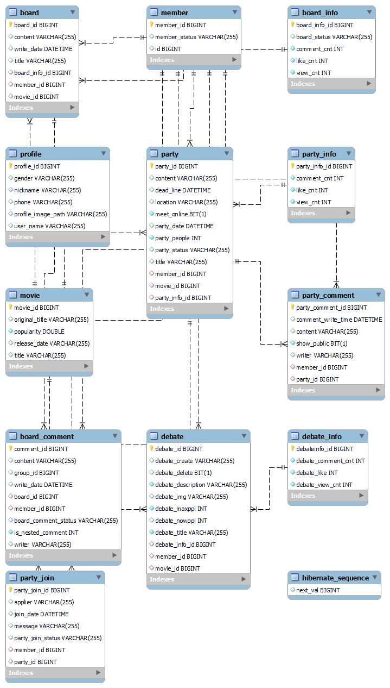

#### 배포 진행 상황

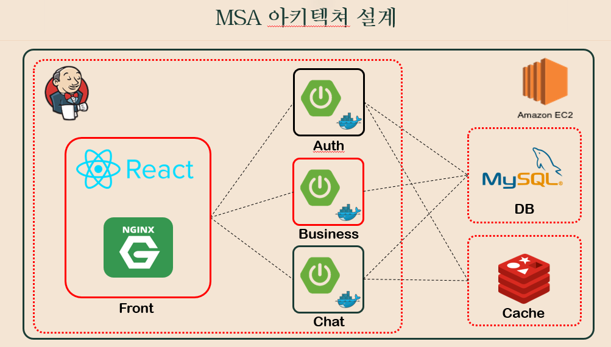
- 붉은색으로 하이라이팅 된 부분이 현재 진행 상황

#### React 컴포넌트 설계

``` bash
src
├── pages // 페이지..
│   ├── Main.js
│   ├── User.js
│   ├── Search.js
│   ├── Community.js
│   └── Profile.js
├── components // 페이지 안 컴포넌트
│   ├── common
│   |   ├── ProfileIcon.js
│   |   ├── MainNav.js
│   |   ├── LogCard.js
│   │   ├── PartyCard.js
│   │   └── ProfileEdit.js
│   ├── main
│   │   ├── MainSearch.js
│   │   └── MainLog.js
│   ├── user
│   │   └── Login.js
│   ├── search
│   │   └── MovieCard.js
│   ├── community
│   │    ├── movie
│   │    │   ├── MovieDetail.js
│   │    │   ├── MovieDetailEval.js
│   │    │   └── MovieDetailEvalResult.js
│   │    ├── board
│   │    │   ├── BoardList.js
│   │    │   ├── BoardCard.js
│   │    │   ├── BoardDetail.js
│   │    │   ├── BoardComment.js
│   │    │   ├── BoardCommentCard.js
│   │    │   ├── BoardSubCommentCard.js
│   │    │   ├── BoardSubCommentInput.js
│   │    │   ├── BoardDetail.js
│   │    │   └── BoardWrite.js
│   │    ├── talk
│   │    │   ├── TalkList.js
│   │    │   ├── TalkCard.js
│   │    │   ├── TalkDetail.js
│   │    │   ├── TalkRoom.js 
│   │    │   └── TalkWrite.js
│   │    ├── party
│   │    │   ├── PartyCandidate.js v
│   │    │   ├── PartyCandidateCard.js
│   │    │   ├── PartyCard.js v
│   │    │   ├── PartyComment.js
│   │    │   ├── PartyDetail.js
│   │    │   ├── PartyDetailCard.js
│   │    │   ├── PartyEnroll.js
│   │    │   ├── PartyWrite.js
│   │    │   └── PartyList.js
│   │    ├── CommunityDetail.js v
│   │    ├── CommunityList.js v
│   │    ├── CommunityNav.js v
│   │    ├── CommunityHeader.js v
│   │    ├── CommunityWrite.js v
│   │    └── CommunityPagination.js v
│   └── profile
│        ├── profile
│        │    └── ProfileCard.js
│        ├── log
│        │    └── LogList.js
│        ├── board
│        │    ├── ProfileBoardList.js
│        │    ├── ProfileBoardCard.js
│        │    └── ProfileBoardNav.js
│        ├── party
│        │    ├── ProfilePartyList.js
│        │    └── ProfilePartyNav.js
│        └── ProfileNav.js
├── api // axios관련..
├── assets // 이미지 등 자료..
├── feature
|    └── reducer
|        ├── MovieReducer.js
|        └── PartyReducer.js
├── App.js
├── index.js
└── store.js
```

### Jira

- Week1


- Week2


- Week3


- Week4


### 개인별 수행 내용

#### 김동률

배포

Front 배포

1. docker로 Nginx 설치
2. Jenkins 프로젝트와 Front git branch 연결 (develop-front)
3. WebHook 등록하여 push 시, 자동 빌드, 배포
4. nginx config 파일 수정 >> path mapping으로 백엔드 프로젝트와 연결
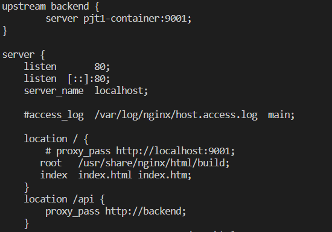
http://3.35.149.202/

Back 배포

1. Docker로 Jenkins 설치
2. Docker로 Mysql:8.0 설치
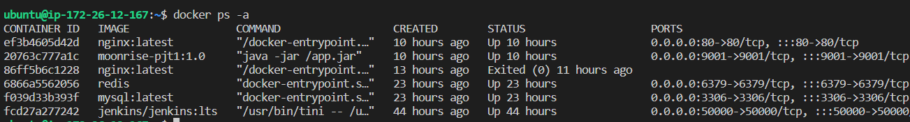

3. Docker 동일 네트워크 구성 (test-network)
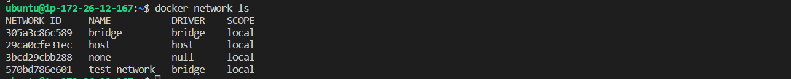
<br>

4. Mysql-container에 네트워크 연결

5. Jenkins 프로젝트와 Back pjt1 (Business Project) 연결 (develop)
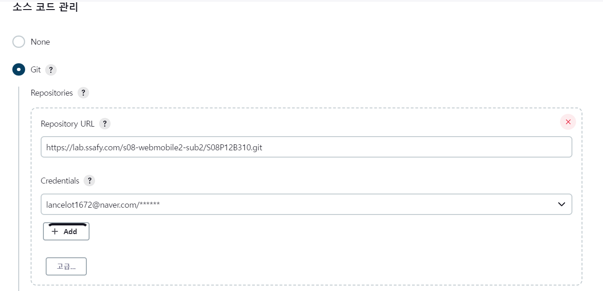
6. 3에서 구성한 네트워크를 연결하여 컨테이너 빌드 및 배포
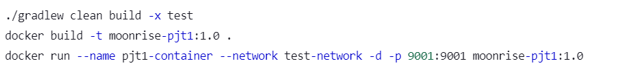

Jenkins 주소 : <http://3.35.149.202:8888/>

회원 Auth 서버 (backend > pjt2)

카카오 소셜 로그인 사용

1. 카카오 인가 코드로 Access-Token, Refresh-Token 발급
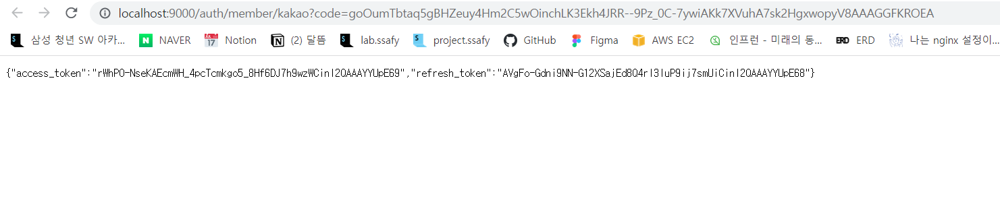
2. Access-Token 파싱 요청
3. kakao_id (고유 ID) 로 회원 DB에 있는지 검사 기능
4. 회원 정보 있으면 Return Token, 없다면 Access-Token만 Return
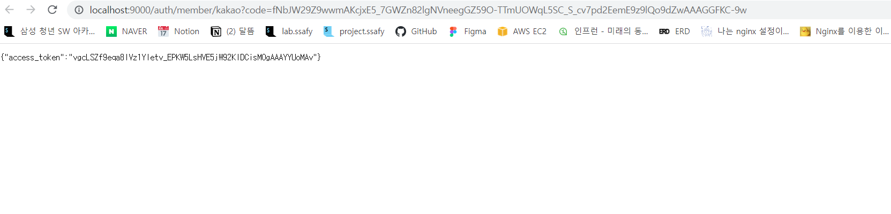

5. Access-Token을 통한 회원 정보 요청
6. Refrash-Token을 통한 Access-Token 재발급 요청

7. 회원가입 테스트
8. 회원조회 테스트

#### 박윤지

- 담당 폴더 디렉토리


- 커뮤니티 게시판
  - 영화별 커뮤니티 게시글 목록
  - 게시글 상세보기
  - 게시글 작성
  - 게시글 수
  - 게시글 상태변경 (삭제, 신고)
  - 게시글 별 댓글 목록
  - 댓글 작성
  - 대댓글 작성
  - 댓글 수정
  - 댓글 상태변경 (삭제, 신고)

- [프로젝트 오답 노트](https://www.notion.so/6bcf3dc7499e43b18a2f8938aa87a16b)

#### 정상민

**소모임 기능 CRUD**

- JPA 엔티티 양방향 매핑, 지연로딩 방법으로 성능 개선

```java
@JsonIgnore
@OneToMany(mappedBy = "party")
private List<PartyJoin> partyJoins = new ArrayList<>();

@JsonIgnore
@OneToMany(mappedBy = "party")
private List<PartyComment> partyComments = new ArrayList<>();

@OneToOne(fetch = FetchType.LAZY, cascade = CascadeType.ALL)
@JoinColumn(name = "party_info_id")
private PartyInfo partyInfo;
```

- Spring Data JPA 활용 객체지향 DB프로그래밍<br>
  @Query 활용 fetch join으로 성능 개선

```java
@Query(value = "select p from Party p join fetch p.partyInfo where p.movie.id = :movieId")
List<Party> findPartyList(@Param("movieId") Long movieId);
```

**Redis Cache Server**

- EC2 Redis 설치


- 게시글, 소모임 조회수 Redis 활용 count

```java
String key = "partyViewCnt::"+partyId; //소모임 별 ID 활용 key 생성
//캐시에 값이 없으면 MySql에서 조회 후 값 증가, 있으면 값을 증가시킨다.
ValueOperations valueOperations = redisTemplate.opsForValue();
if(valueOperations.get(key)==null){ //캐시가 값이 없어 DB에 조회 후 값 증가
    valueOperations.set( //DB select 후 캐시에 값 저장
            key,
            String.valueOf(partyInfoRepository.findPartyViewCnt(partyId)+1),
            Duration.ofMinutes(-1));
}
else{
    valueOperations.increment(key); // 캐시에 값 있으므로 증가시킴
}
int viewCnt = Integer.parseInt((String) valueOperations.get(key)); // 현재 조회수 값
```

이로써 조회수 증가는 캐시에서 실시
이후 주기적으로 DB에 캐시에 저장되있는 조회수 값 갱신
이후 소모임 조회수 캐시 리셋

```java
@Transactional
@Scheduled(cron = "0 0/3 * * * ?")
public void deleteViewCntCacheFromRedis() {
    Set<String> redisKeys = redisTemplate.keys("partyViewCnt*");
    Iterator<String> it = redisKeys.iterator();
    while (it.hasNext()) {
        String data = it.next();
        Long partyId = Long.parseLong(data.split("::")[1]);
        int viewCnt = Integer.parseInt((String) redisTemplate.opsForValue().get(data));
        PartyInfo partyInfo = partyInfoRepository.findById(partyId).get();
        partyInfo.setViewCnt(viewCnt);
        redisTemplate.delete(data);
        redisTemplate.delete("party::"+partyId);
    }
}
```

#### 조원희

- 토론 게시판
  - 영화별 토론게시글 목록
  - 토론게시글 상세보기
  - 토론게시글 작성
  - 토론게시글 수정
  - 토론 게시글 상태변경 (삭제)
  - 토론 좋아요, 조회수, 댓글수 반영

#### 권지훈

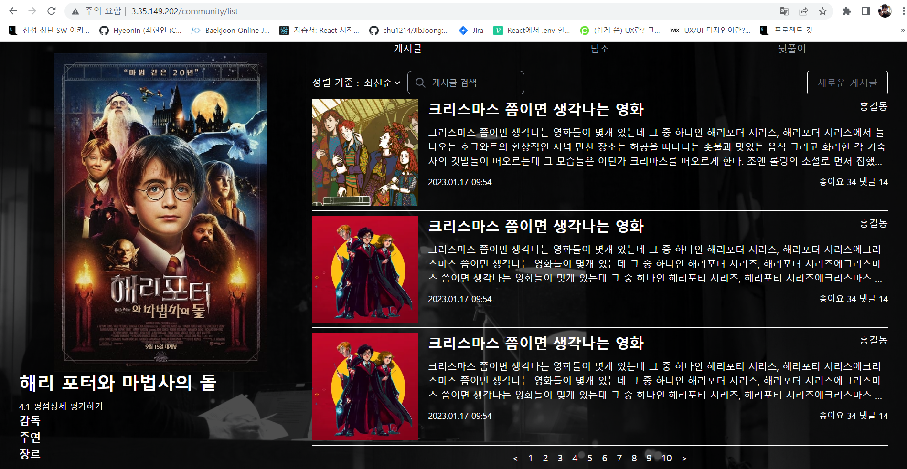
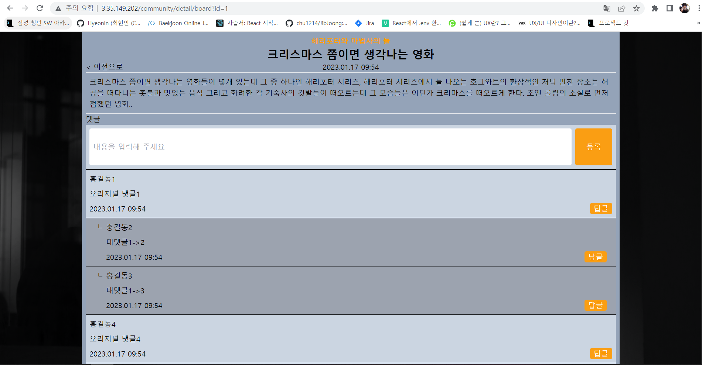
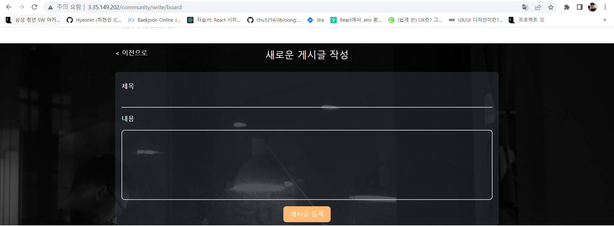

- 게시글(목록, 생성, 상세) 페이지 제작
  - DUMMY_DATA를 이용한 출력 확인
    - 댓글, 대댓글 출력 설계
- 영화 상세 정보 페이지 제작

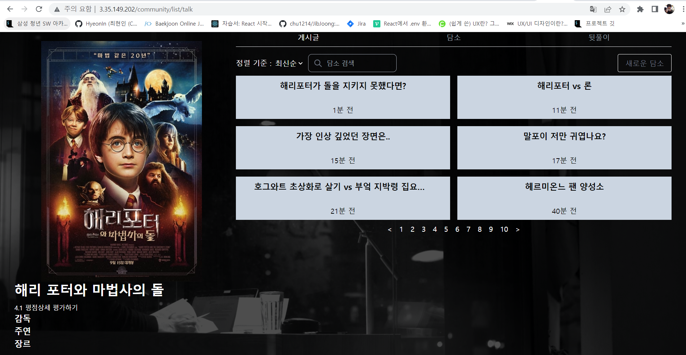
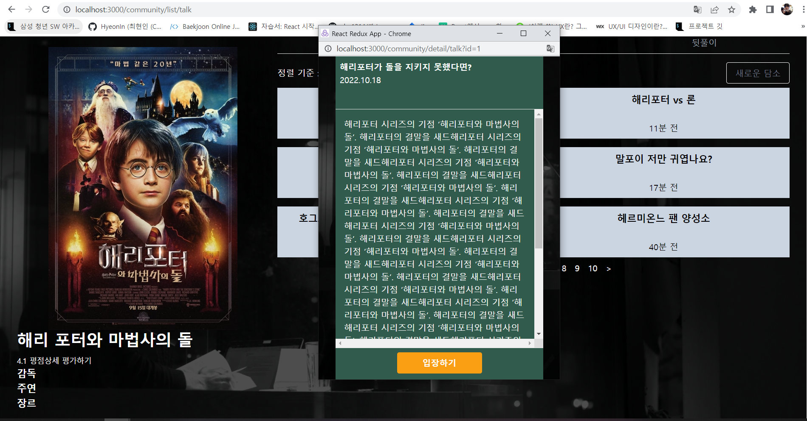
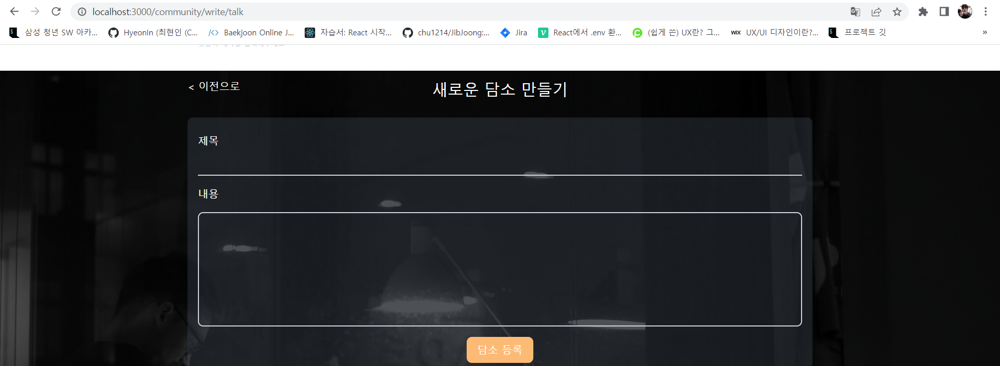

- 담소(목록, 생성, 상세) 페이지 제작
  - DUMMY_DATA를 이용한 출력 확인
    - 토론방 팝업창으로 출력

#### 최현인

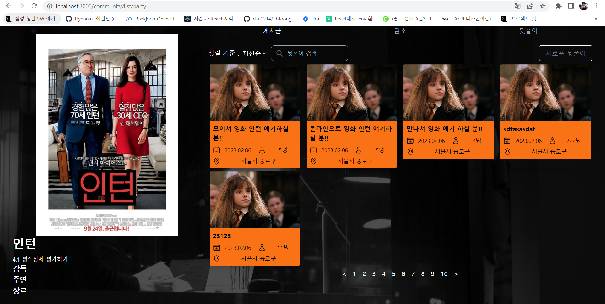
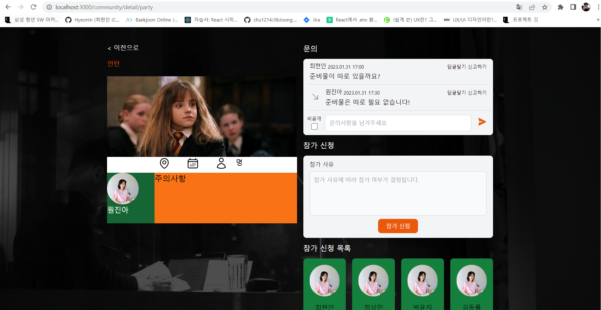
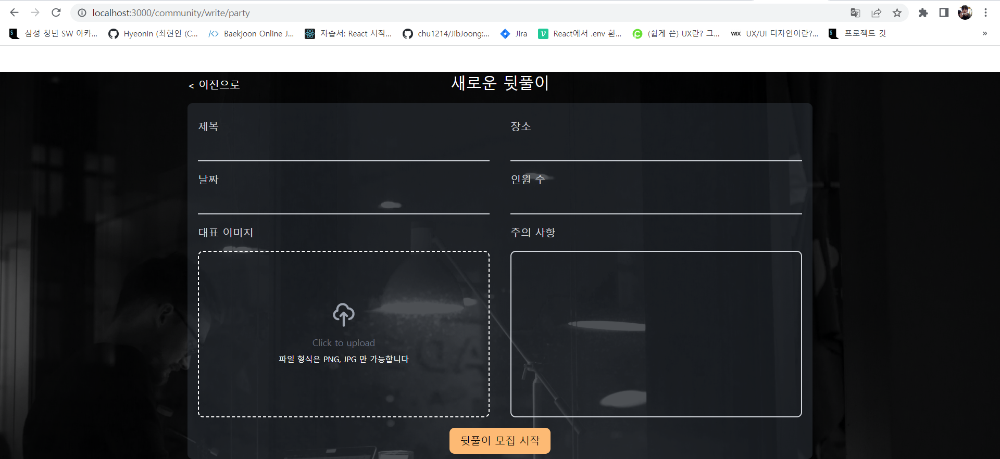

- 뒷풀이(목록, 생성, 상세) 페이지 제작
  - rest api 연동 완료
  - Redux 활용하여 뒷풀이 state 관리

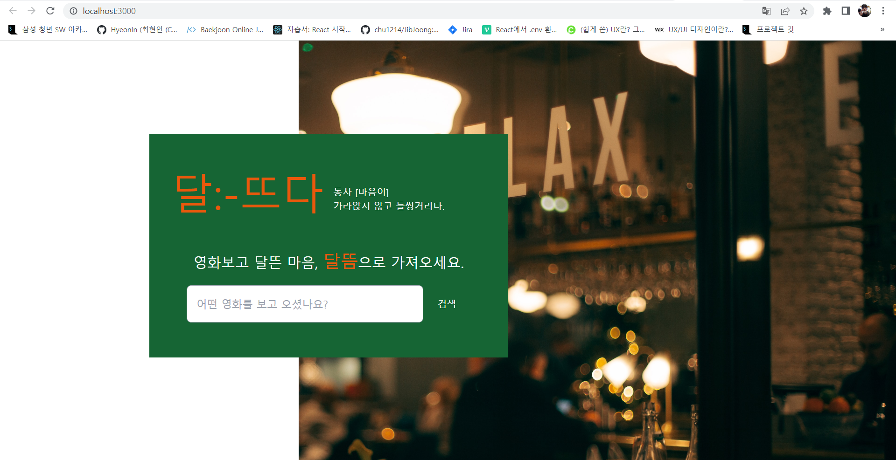

- 메인 페이지 제작
  - 영화 검색 기능 구현
    - tmdb rest api 사용

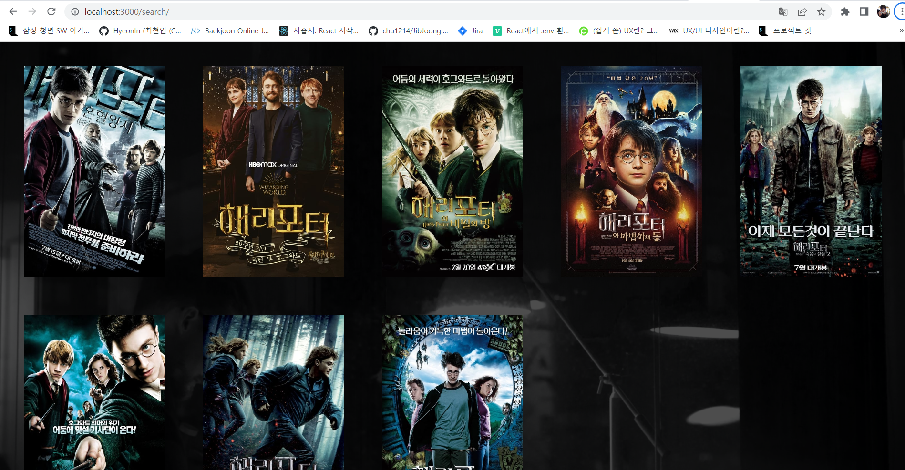

- 검색 결과 페이지 제작
  - Redux 활용하여 영화 관련 state 관리

- Redux 및 axios 환경 세팅
- 프론트 1차 배포 빌드

### 향후 계획

#### BackEnd

- Exception처리
- Interceptor처리
- 회원인증 테스트
- 페이징 처리 (게시글, 뒷풀이, 담소)
  - 게시글 좋아요
  - 게시글 북마크
  - 게시글 조회수
  - 게시글 인기목록
- 영화 평점 생성, 수정 기능
  - 회원이 제출한 평점에 대한 평균치 계산 기능
- 영화 검색 기능
  - 영화 검색 시 DB와 API중복검사
  - DB에서 영화 검색 시 빠른 처리를 위한 알고리즘 적용
  - 영화 검색 시 DB에 저장되도록 기능 개발
  - <https://magnificent-nannyberry-7ea.notion.site/3d126464fedd4e708064f2f3578853db>

#### FrontEnd

- 유저 관련 페이지 제작
  - 로그인/회원가입
  - 마이 페이지
- 게시글, 담소 페이지
  - rest api 연동
  - Redux 활용하여 state 관리
- 영화 상세 정보 페이지
  - rest api 연동
  - 상세 평점 보기, 등록 모달 구현
- 유저 관련 페이지 제작
  - 로그인/회원가입
  - 마이 페이지
- 생성 페이지 에디터 적용
  - 날짜 입력 라이브러리 서칭
- 디자인 퀄업 및 다이나믹 디자인 적용
- 코드 리팩토링
  - 컴포넌트 최적화
  - Redux 최적화